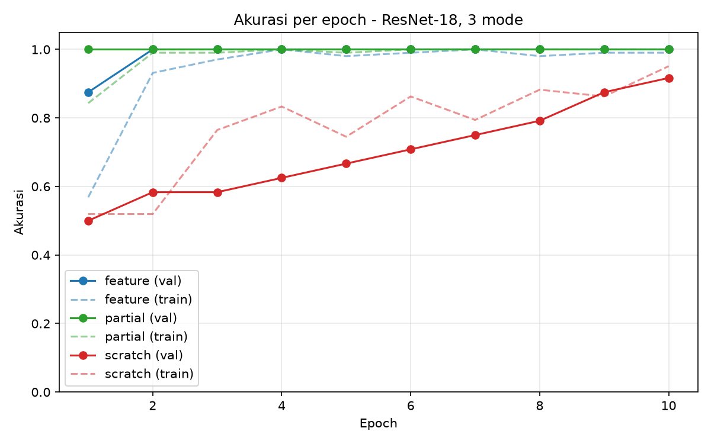

# RET503 · Pertemuan 3 · Transfer Learning untuk Klasifikasi Sampah

**Nama:** _(isi)_ · **NIM:** _(isi)_ · **Kelompok:** _(isi)_

Klasifikasi sampah **botol** dan **tissue** dari kamera robot memakai **ResNet-18** dengan tiga mode transfer learning (*feature*, *partial*, *scratch*), lalu mengukur latensinya dibandingkan **MobileNetV3-Small**. Semua citra diambil sendiri dengan webcam USB yang sudah dikalibrasi, dan setiap citra di-*undistort* sebelum disimpan.

---

## 1. Struktur repository

```
├── dataset_raw/
│   ├── botol/              66 citra (.png, 640×480, sudah di-undistort)
│   ├── tissue/             60 citra
│   └── metadata.csv        nama_file, kelas, tanggal, kondisi_cahaya
├── hasil/
│   ├── ringkasan.csv       tabel hasil 3 mode
│   ├── grafik_akurasi.png  grafik akurasi per epoch
│   ├── log_<mode>.csv      loss & akurasi per epoch
│   ├── salah_<mode>.csv    citra val yang salah ditebak
│   ├── latensi.csv         hasil pengukuran latensi
│   └── kelas.json          urutan nama kelas
├── calib.npz               hasil kalibrasi kamera (K, dist, ukuran citra, RMS)
├── capture.py              ambil citra + undistort + catat metadata
├── split.py                bagi data train/val (per blok, anti-leakage)
├── train.py                latih ResNet-18 tiga mode
├── latency.py              ukur latensi model & alur lengkap
└── (skrip kalibrasi)       calibration_utils.py, cameraCalibration.py,
                            simpan_kalibrasi.py, cek_undistort.py, potret.py
```

Bobot model (`hasil/*.pt`, ±45 MB per file) dan folder `dataset_split/` tidak di-upload karena ukurannya besar dan bisa dibuat ulang dengan `split.py` dan `train.py`.

## 2. Cara menjalankan

Lingkungan: Windows, Python 3.14, PyTorch 2.14.0 (CPU), torchvision 0.29.0, OpenCV, NumPy, Matplotlib.

```bash
pip install torch torchvision opencv-python numpy matplotlib

python capture.py botol terang      # ambil citra: <kelas> <kondisi_cahaya>
python split.py                     # dataset_raw -> dataset_split/train & val
python train.py                     # tiga mode; atau: python train.py feature
python latency.py                   # latensi model terpilih (bawaan: feature)
```

## 3. Kalibrasi kamera (dasar untuk undistort)

Webcam USB dikalibrasi dengan papan catur 8×8 kotak (7×7 sudut dalam) pada resolusi **640×480**, resolusi yang sama dengan saat pengambilan dataset.

| Item | Nilai |
|---|---|
| Foto papan / terdeteksi | 38 / 28 |
| RMS reprojection error | **0,817 piksel** (kategori "cukup") |
| fx, fy | 839,3 ; 837,6 |
| cx, cy | 327,9 ; 222,7 (dekat pusat citra 320, 240) |
| Distorsi [k1, k2, p1, p2, k3] | −0,341 ; 1,554 ; 0,004 ; 0,004 ; 0 |

Dua penyesuaian dari program bawaan: pendeteksi sudut diganti `cv2.findChessboardCornersSB` karena papan catur permainan tidak memiliki margin putih (deteksi naik dari 4 menjadi 14 foto pada percobaan awal), dan `k3` dikunci ke 0 (`CALIB_FIX_K3`) karena tanpa itu koefisien distorsi menjadi tidak wajar (k3 ≈ −74) akibat *overfitting*. Undistort memakai `alpha = 0` agar tepi hitam terpotong.

## 4. Dataset

| Kelas | terang | redup | bayangan | Total |
|---|---|---|---|---|
| botol | 32 | 17 | 17 | **66** |
| tissue | 30 | 15 | 15 | **60** |

Variasi yang sengaja dibuat: beberapa objek berbeda per kelas (minimal 5 jenis botol; tissue lembaran, diremas, sobek), posisi di tengah dan tepi frame, jarak dekat–jauh, beberapa objek sekaligus, serta latar keramik putih, lantai cokelat-oranye, dan meja kayu.

Catatan kejujuran data:
- Kelas **kertas** dari rancangan proyek kelompok belum diambil; dataset minggu ini baru dua kelas.
- Sebagian citra botol berlabel `redup` sebenarnya diambil dalam kondisi bayangan.
- Citra `redup` tidak jauh lebih gelap daripada `terang`, karena *auto exposure* webcam menaikkan kecerahan secara otomatis.

## 5. Pembagian data (anti-leakage)

Citra yang diambil beruntun cenderung mirip. Jika diacak biasa, citra "kembar" bisa masuk train dan val sekaligus sehingga akurasi val terlalu optimistis. Karena itu `split.py` mengurutkan citra per kelas dan per kondisi cahaya berdasarkan nomor, lalu mengambil **blok terakhir (±20%)** sebagai val.

| Kelas | train | val |
|---|---|---|
| botol | 54 | 12 |
| tissue | 48 | 12 |
| **Total** | **102** | **24** |

## 6. Eksperimen

| Mode | Bobot awal | Yang dilatih | Learning rate |
|---|---|---|---|
| feature | ImageNet | `fc` | 1e-3 |
| partial | ImageNet | `layer4` + `fc` | 1e-4 / 1e-3 |
| scratch | acak | semua | 1e-3 |

Pengaturan bersama: input 224×224, normalisasi ImageNet, augmentasi train (RandomResizedCrop skala 0,6–1,0, HorizontalFlip, ColorJitter), Adam, CosineAnnealingLR, 10 epoch, batch 16, seed 42, CPU. Lapisan yang dibekukan tetap dalam mode `eval()` agar statistik BatchNorm ImageNet tidak berubah.

## 7. Hasil

| Mode | Akurasi val terbaik | Epoch pertama val ≥ 90% | Waktu latih (10 epoch) |
|---|---|---|---|
| feature | **100%** | 2 | 93 detik |
| partial | **100%** | 1 | 114 detik |
| scratch | 91,7% | 10 | 203 detik |

Akurasi val per epoch:

| Epoch | 1 | 2 | 3 | 4 | 5 | 6 | 7 | 8 | 9 | 10 |
|---|---|---|---|---|---|---|---|---|---|---|
| feature | 0,875 | 1,000 | 1,000 | 1,000 | 1,000 | 1,000 | 1,000 | 1,000 | 1,000 | 1,000 |
| partial | 1,000 | 1,000 | 1,000 | 1,000 | 1,000 | 1,000 | 1,000 | 1,000 | 1,000 | 1,000 |
| scratch | 0,500 | 0,583 | 0,583 | 0,625 | 0,667 | 0,708 | 0,750 | 0,792 | 0,875 | 0,917 |



## 8. Latensi

Diukur pada laptop _(isi nama prosesor, mis. AMD Ryzen ...)_, CPU 4 thread, tanpa GPU, batch 1, 100 kali pengulangan setelah 10 kali pemanasan.

| Yang diukur | Rata-rata (ms) | p95 (ms) | FPS |
|---|---|---|---|
| ResNet-18 (model saja) | 70,4 | 75,7 | 14,2 |
| MobileNetV3-Small (model saja) | 15,9 | 20,8 | 62,7 |
| Alur lengkap ResNet-18 | **74,2** | 81,2 | **13,5** |
| ↳ undistort | 1,6 | | |
| ↳ praproses (BGR→RGB, resize, normalisasi) | 1,9 | | |
| ↳ inferensi ResNet-18 | 70,8 | | |

Anggaran 15 FPS = 67 ms per frame. Alur lengkap ResNet-18 **melebihi anggaran sekitar 7 ms**. Jumlah parameter MobileNetV3-Small tercatat 1,5 juta (bukan ±2,5 juta) karena lapisan klasifikasi 1000 kelas ImageNet sudah diganti menjadi 2 kelas.

## 9. Analisis singkat

**Hipotesis terbukti.** Dengan hanya 102 citra latih, kedua mode transfer learning mencapai akurasi val 100% dalam 1–2 epoch, sedangkan *scratch* baru mencapai 91,7% di epoch terakhir. Bobot ImageNet sudah berisi detektor fitur umum (tepi, tekstur, bentuk) sehingga model hanya perlu mempelajari pemisah dua kelas di lapisan akhir. Model *scratch* harus mempelajari semua fitur itu dari nol: di epoch 1 akurasinya 50%, sama dengan menebak acak untuk dua kelas, dan kurvanya masih naik di epoch 10, sehingga 10 epoch belum cukup baginya.

**Akurasi 100% perlu dibaca dengan hati-hati.** Selain efek transfer learning, ada tiga faktor yang membuat angka ini terlalu optimistis:
1. **Tugasnya mudah.** Botol dan tissue sangat berbeda bentuk dan teksturnya, dan ImageNet sendiri sudah memiliki kelas *water bottle* dan *toilet tissue*.
2. **Data val kecil (24 citra).** Satu kesalahan saja menurunkan akurasi sekitar 4%.
3. **Objek dan ruangan yang sama** muncul di train dan val. Split per blok mengurangi kebocoran antarfoto beruntun, tetapi belum menguji botol baru di tempat baru.

**Pilihan model: ResNet-18 mode *feature*.** Akurasinya sama dengan *partial*, tetapi latihannya lebih cepat dan hanya melatih lapisan `fc`, sehingga risiko *overfitting* pada data kecil lebih rendah. Latensi inferensinya sama dengan *partial* karena arsitekturnya sama.

**Latensi.** Sekitar 95% waktu alur habis di inferensi model; undistort dan praproses hanya ±3,5 ms. Jadi kalibrasi kamera hampir tidak membebani kecepatan. Karena ResNet-18 sedikit melewati anggaran 67 ms di CPU ini, MobileNetV3-Small (±4,4× lebih cepat) layak dilatih dengan cara yang sama untuk robot tanpa GPU, dengan catatan akurasinya pada data ini belum diukur.

## 10. Keterbatasan dan langkah berikutnya

- Menambahkan kelas **kertas**, yang akan menjadi uji sebenarnya karena kertas dan tissue mirip.
- Membuat data uji dari **lokasi dan objek baru** yang tidak pernah muncul di train.
- Melatih *scratch* lebih dari 10 epoch untuk melihat batas akurasinya.
- Melatih MobileNetV3-Small dan membandingkan akurasi–latensi secara langsung.

## Lampiran

- Dokumen desain awal (kelompok): _(tautan/nama file)_
- Refleksi individu: _(tautan/nama file)_
